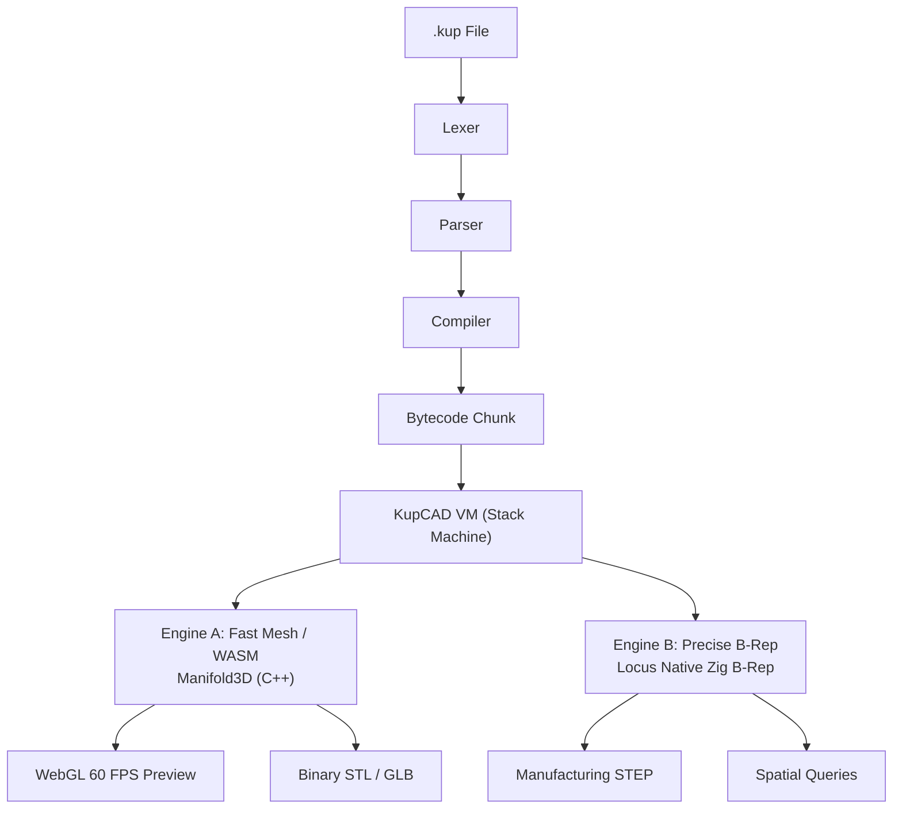

# **KupCAD Language & Architecture Specification**

**Version:** 1.0.0
**Core Runtime:** Custom Zig Bytecode VM (`VM`) + Manifold3D (Mesh/Preview) + Locus Native B-Rep (STEP/Analytical)
**Syntax Paradigm:** Ruby-inspired, Expression-based, Method-chaining OOP

## **1. Syntax & Core Concepts**

KupCAD (`.kup`) is a high-level, expression-based parametric CAD language executing on a custom stack-based VM. Primitives are generated via built-in classes like `Solid` and `Sketch2D`. Every operation returns a first-class geometry node, enabling fluid method-chaining.

### **3D Primitives & Assemblies**

Primitives accept intelligent keyword arguments, including native support for rounded corners and chamfers directly during instantiation.

```ruby
# Native 3D primitives with built-in filleting
base_box = Solid.cube(x: 50, y: 30, z: 20, round_r: 2.0, center: true)
cyl = Solid.cylinder(r: 5, h: 40, chamfer: 1.0)
ring = Solid.torus(major_r: 10.0, minor_r: 2.0)
custom = Solid.polyhedron(points: [...], faces: [...])

# Method-chained transformations & CSG booleans
housing = base_box
  .translate(z: 10)
  .difference(cyl)

# Grouping parts into structured, named assemblies
final_part = assemble(name: "HousingAssembly", parts: [housing, ring])

```

### **Batch CSG & Operator Overloading**

You can use standard math operators (`+`, `-`, `&`) for binary CSG, or utilize batch operations for arrays of geometry to heavily optimize the evaluation graph:

```ruby
# Union or Hull across entire arrays natively
pins = [Solid.cylinder(r: 2, h: 10), Solid.cylinder(r: 2, h: 10).translate(x: 20)]
casing = union(pins)
convex_wrap = batch_hull(pins)

```

---

## **2. 2D Sketching, Profiles, & Text**

The `Sketch2D` class provides powerful 2D cross-section primitives that can be swept into 3D.

```ruby
# Advanced 2D Polygons with Hole support (Even-Odd winding rules)
profile = Sketch2D.polygon(
  [[0,0], [10,0], [10,10], [0,10]],
  paths: [[[2,2], [8,2], [8,8], [2,8]]] # Inner cutout hole
)

# Text Generation with alignment and typography controls
label = Sketch2D.text("KupCAD", size: 12.0, font: "sans", halign: "center", valign: "baseline")

# Sweeping 2D into 3D
3d_label = label.extrude(5.0)
knob = Sketch2D.regular_polygon(sides: 6, r: 15).revolve(angle: 360)
thread = Sketch2D.circle(r: 1).helix(pitch: 2.0, height: 20.0)

```

---

## **3. Core Standard Library & Block Iteration**

KupCAD is a Turing-complete language with a robust standard library and functional iteration patterns.

### **Blocks and Closures**

KupCAD fully supports Ruby-style block execution using `do |args| ... end` or `{ |args| ... }`.

```ruby
# Using the block to generate an array of cylinders
pegs = []
(0...3).each do |row|
  pegs.push( Solid.cylinder(r: 2, h: 10).translate(x: row * 10) )
end

```

### **Native Collections**

* **Arrays**: Exposes functional mutators (`.push`, `.pop`, `.shift`, `.unshift`, `.slice`, `.join`), iterators (`.each`, `.map`, `.filter`, `.reduce`), and native numeric reducers (`.max`, `.min`, `.sum`, `.sort`).
* **Maps**: Exposes key/value manipulation (`.keys`, `.values`, `.has_key?`, `.delete`, `.get`, `.merge`, `.empty?`). Keys can be swapped dynamically via `.symbolize_keys` and `.stringify_keys`.

### **Strings, Symbols & Math**

* **Strings**: Support `.length`, `.size`, `.upcase`, `.downcase`, `.trim`, `.split`, and `.replace`. Strings can check prefixes/suffixes with `.starts_with?` and `.ends_with?`, and typecast using `.to_sym`, `.to_f`, and `.to_i`.
* **Symbols**: Lightweight, interned identifiers (`:name`) used heavily for parameter keys and map properties.
* **Math Module**: Exposes variadic `.min` and `.max`, trigonometric functions (`.sin`, `.cos`, `.tan`, `.asin`, `.acos`, `.atan2`), and CAD-specific interpolation helpers (`.clamp`, `.lerp`, `.hypot`, `.sign`).

### **Base Object Introspection**

* All objects and geometry nodes support introspection methods like `.is_a?`, `.responds_to?`, and `.nil?`.
* You can duplicate instances using `.dup` or `.clone`, extract bound functions using `.method`, or yield to blocks contextually via `.tap` and `.into`.

---

## **4. Parametric UI & The "Hybrid Architecture"**

KupCAD uses a **Hybrid Architecture** for parametric UI generation. The `param` keyword executes securely inside the VM, validating types, enforcing bounds, and extracting precise line/column locations for stack-trace error reporting if validation fails.

```ruby
# @title Heavy Duty Bracket
# @description A parametric L-bracket optimized for 3D printing.

# Supports min, max, and exact choice arrays
width = param(:width, default: 20.0, validate: { min: 10.0, max: 100.0 })
material = param(:material, default: "PLA", validate: { in: ["PLA", "PETG", "ABS"] })

def build
  # Dynamic retrieval halts execution safely if constraints are violated
  Solid.cube(x: width, y: 50, z: 5)
end

```

Global CAD engine overrides can be dynamically applied using the `CAD` module:

```ruby
# Force specific tessellation resolutions for the enclosed block
CAD.with_config({ manifold: { min_angle_deg: 5.0 } }) do
  Solid.sphere(r: 10)
end

```

---

## **5. Geometry Modifiers & Sweeps**

KupCAD exposes an exhaustive list of native mesh manipulation methods attached to all evaluated solid and 2D nodes:

* **Transforms**: `.translate`, `.rotate`, `.scale`, `.mirror`, `.align`, `.center`, `.transform` (Matrix), `.resize`.
* **Arrays**: `.repeat_linear`, `.repeat_polar`.
* **Sweeps**: `.extrude`, `.revolve`, `.helix`, `.loft`.
* **Advanced**: `.hull`, `.minkowski`, `.trim_by_plane`, `.split_by_plane`, `.offset`, `.slice`, `.project`, `.fillet_edges`, `.simplify`, `.decompose`, `.on_face`.

---

## **6. Inspection & Spatial Alignment**

Evaluated geometry nodes are first-class objects with natively exposed mass properties and exact spatial bounding boxes.

```ruby
box = Solid.cube(x: 50, y: 30, z: 20)

# Physical inspection
bounds = box.bbox()             # Returns a BoundingBox object
vol = box.volume()              # mm³
area = box.surface_area()       # mm²
gap = box.min_gap(other_part)   # Shortest distance between two solids
is_inside = box.contains?(pt)   # Point-in-polygon/solid check
topology = box.genus()          # Topological genus (holes)

```

---

## **7. System Kernel & Development Modifiers**

The `Kernel` class provides global host bindings for I/O, garbage collection, and debugging.

```ruby
# CLI Output & Assertions
Kernel.puts("Generating parts...")
Kernel.assert(vol > 0, "Volume must be positive")
Kernel.benchmark { heavy_csg_operation() }

# Memory introspection
GC.collect()
puts(GC.bytes_allocated())

```

KupCAD also provides non-destructive inline modifiers to alter visibility in the viewport and inject metadata:

```ruby
# Debugging Modifiers pushed to the VM display list
env = Solid.cube(100).ghost           # Renders as a semi-transparent mesh
bolt = Solid.cylinder(r: 3).highlight # Forces high-contrast visibility

# Material metadata assigned to the geometry handle (propagates to GLB exports)
part = Solid.cube(10).material(color: "#FF0000", roughness: 0.2, metallic: 0.8)

```

---

## **8. Module & Asset Imports**

KupCAD uses a Content Addressable File System (CAFS) paired with an SQLite cache for dependency management. External solid files are parsed and injected directly into the VM.

```ruby
# 1. Importing native KupCAD modules via isolated lexical scope
import "[github.com/kupcad-libs/hardware](https://github.com/kupcad-libs/hardware)"

# 2. Importing external 3D CAD assets directly into the CSG tree
bearing = import_step("assets/608_bearing.step")
logo = import_stl("assets/logo.stl")

```

---

## **9. Architecture & Execution Pipeline**

The KupCAD engine is implemented entirely in **Zig**, relying on a dual-engine architecture governed by a robust VM.

* **The Session Manager**: Coordinates multi-file dependency trees using Kahn's Topological Sort and enforces strict RAM budgeting via LRU eviction.
* **$O(1)$ DAG Caching**: The `dag_evaluator` intercepts geometric evaluations, mapping cryptographic hashes of AST operations to pre-solved pointers, completely bypassing C++ FFI crossings on cached nodes.



---

## **10. IDE & Toolchain Ecosystem (`src/cli/`)**

KupCAD ships as a monolithic executable containing a complete developer toolchain:

* `kupcad lsp`: Language Server Protocol daemon for VS Code, enabling real-time preview gateways.
* `kupcad fmt`: AST-based Code Formatter.
* `kupcad check`: Linter catching unused variables, zero-volume operations, and logic errors.
* `kupcad pkg`: Lockfile-driven dependency resolver fetching GitHub packages into CAFS.
* `kupcad build`: Multi-Target Exporter (`STEP`, `STL`, `GLB`) with CLI parameter injection.
* `kupcad watch`: Real-time incremental rebuilding utilizing the persistent `SessionManager`.
* `kupcad dev`: VM development toolkit offering `ast-dump`, `disasm`, and `bench`.
