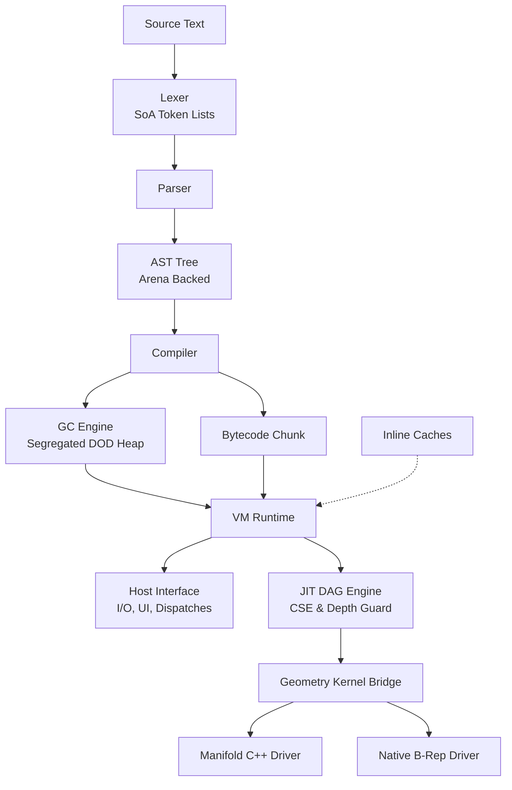
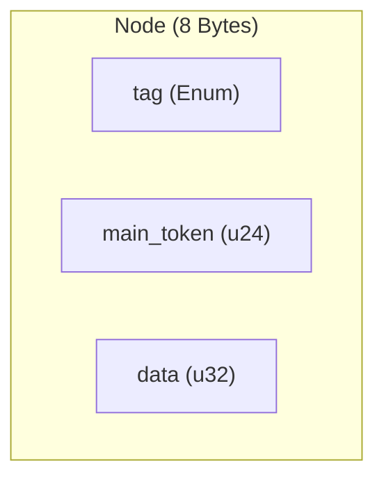
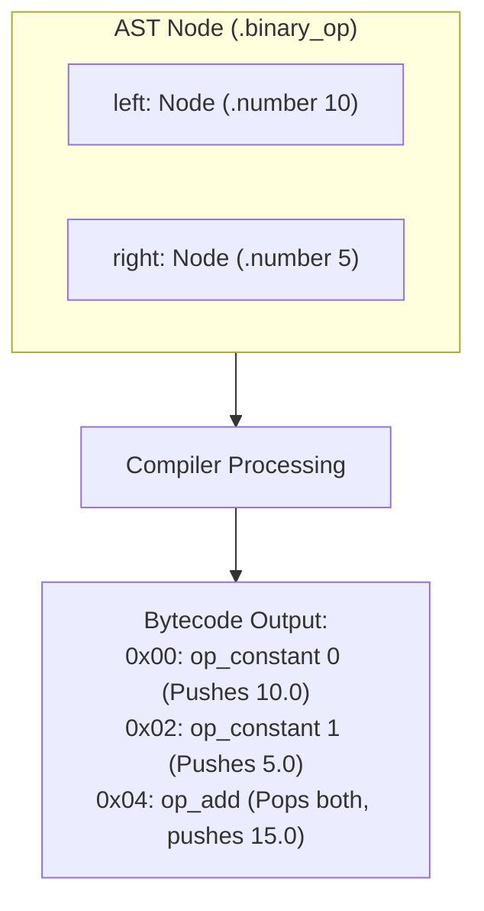
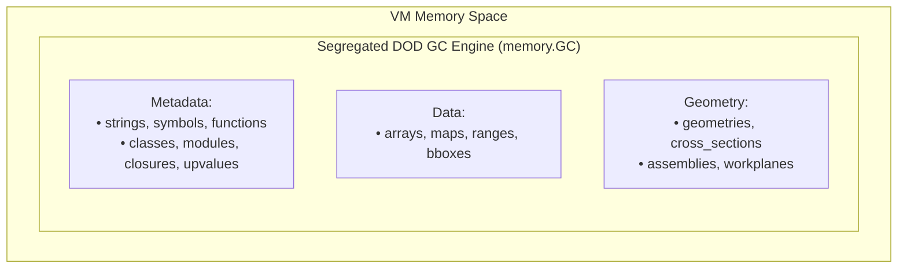
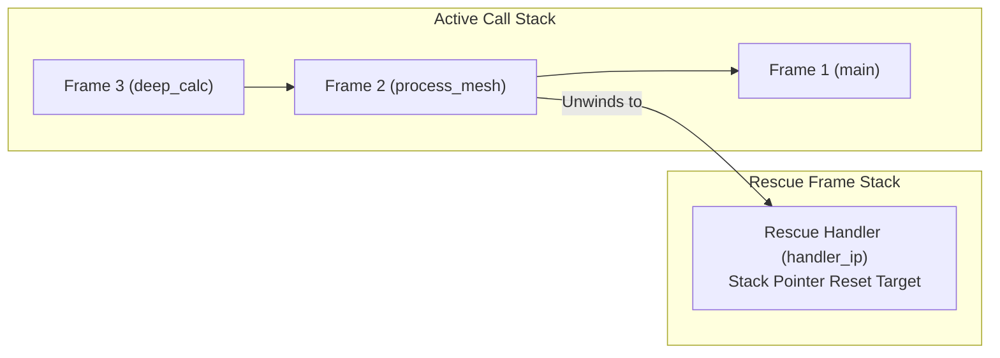
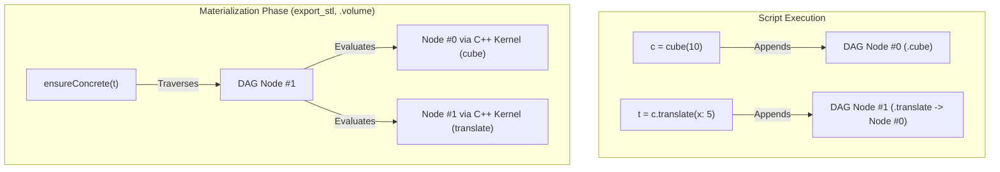

# KupCAD System Architecture & Memory Model

The KupCAD pipeline is structured as a multi-pass CAD language compiler and virtual execution environment, optimized for zero-waste memory access, explicit memory ownership, and deferred 3D geometry evaluation.



---

## 1. Lexical Analysis (The Lexer)

The Lexer scans raw source text and converts character streams into tokens using a **Structure of Arrays (SoA)** memory layout.

* **Zero-Allocation Scanning:** The Lexer does not allocate individual token objects. It scans strings directly from source memory and records byte offsets.
* **SoA Token Storage:** Tokens are stored across three contiguous, cache-line-friendly arrays:
* `tags: []Tag` (e.g., `.keyword_def`, `.number`, `.ident`)
* `starts: []u32` (Source code byte offsets)
* `lengths: []u32` (Token byte lengths)


* **Compile-Time Keyword Hashing:** Identifiers are evaluated via `std.StaticStringMap` at compile time, yielding $O(1)$ keyword resolution without heap allocations or string branching.

```zig
// Data layout inside TokenList
pub fn TokenList(comptime Tag: type) type {
    return struct {
        tags: []const Tag,
        starts: []const u32,
        lengths: []const u32,
    };
}

```

---

## 2. Abstract Syntax Tree (The AST)

The AST uses a **Data-Oriented Cache-Dense Layout**. Nodes avoid heap pointers and object graphs.

* **Compact Node Size:** Every AST `Node` is packed into **exactly 8 bytes** for L1 cache line density.
* **Index-Based References:** Nodes refer to child nodes, spans, or interned strings using 32-bit integer indices (`NodeIndex`, `StringId`) instead of pointers.
* **Side-Table Metadata:** Extended payloads (such as function parameters or multi-branch `case/when` lists) are appended to a contiguous `extra_data: ArrayListUnmanaged(u32)` buffer.
* **String Interning:** Identifier and string literal characters are stored in a dedicated String Pool. Duplicate strings map to the exact same `StringId`, turning name comparisons into $O(1)$ integer equality checks.



---

## 3. Bytecode Compilation (The Compiler)

The Compiler traverses the AST and translates nodes into virtual machine instruction streams called **Chunks**.



* **Locals vs. Globals:** Local variables live directly in evaluation stack slots. Name lookup is resolved at compile time to a 1-byte or 2-byte index (`op_get_local`, `op_get_local_wide`).
* **Wide Instruction Variants:** To break standard 255-item operand boundaries without sacrificing bytecode density, instructions support `_wide` variants (e.g., `op_constant_wide`, `op_closure_wide`, `op_switch_wide`) using 16-bit operands.
* **Upvalue Resolution:** When a closure captures a variable from an outer function, the Compiler generates an `Upvalue` mapping. The VM bridges this slot either directly on the evaluation stack or hoists it to the heap when the outer function frame returns.
* **Stack Depth Simulation:** The Compiler maintains `current_stack_depth` and `max_stack_depth` counters during code generation. `errdefer` stack restoration guards ensure that compilation failures (e.g., constant pool overflow) roll back stack depth counters cleanly to prevent compiler assertions from panicking.

---

## 4. Virtual Machine Runtime & Memory Management

KupCAD employs a **Segregated Data-Oriented Design (DOD) Tracing Garbage Collector** that manages all language objects and CAD handles through flat memory slices.



### Segregated DOD Object Tracking

Instead of a single heterogeneous linked list, `memory.GC` organizes object allocations into 19 dedicated `ArrayListUnmanaged` arrays (`strings`, `geometries`, `closures`, `instances`, etc.).

* **Iterative Mark Phase:** Mark roots originate from evaluation stack slots (`vm.stack`), active call frames (`vm.frames`), global symbol tables, and static pre-interned literals (`static_true`, `static_false`, `static_nil`). Reference tracing uses an explicit `gray_stack: ArrayListUnmanaged(*Obj)` to prevent C-stack overflows on deeply nested object structures.
* **Contiguous Sweep Phase:** Unreferenced objects are swept via contiguous slice iteration using $O(1)$ `swapRemove`. When a geometry handle (`ObjGeometry` or `ObjCrossSection`) is swept, the GC automatically invokes the registered host mesh destructor to release native C++ kernel handles.

### Stack Safety & Open Upvalue Patching

The VM evaluation stack (`vm.stack`) pre-allocates contiguous `Value` slots and grows dynamically via `ensureStackCapacity`.

When the evaluation stack reallocates to a new memory block:

1. The byte offset delta between the old and new stack base pointers is calculated.
2. The VM traverses the `open_upvalues` linked list and patches every active `location` pointer (`u.location = new_base + offset`).

This prevents open upvalues from dangling or pointing to deallocated stack memory during runtime stack expansions.

### Inline Caching (IC)

Property getters/setters (`op_get_property`, `op_set_property`) and method invocations (`op_invoke`) use a **2-Way Polymorphic Inline Cache (PIC)** (`InlineCache` in `chunk.zig`).

```zig
pub const InlineCache = struct {
    cached_class_1: ?*value.ObjClass = null,
    cached_val_1: value.Value = value.Value.initNil(),
    offset_1: usize = 0,

    cached_class_2: ?*value.ObjClass = null,
    cached_val_2: value.Value = value.Value.initNil(),
    offset_2: usize = 0,
};

```

* **Monomorphic Hit:** If the receiver's `ObjClass` matches `cached_class_1`, field access or method dispatch executes in $O(1)$ time bypassing table lookup.
* **Polymorphic Graduation:** If a second receiver class is encountered, slot 2 (`cached_class_2`) is populated to accelerate multi-type call sites without cache thrashing.

### Dictionary Interning & The Scratch Arena

* **Strict Value Dictionaries:** All object dictionaries (`methods`, `class_fields`, `instance_fields`, `map`) strictly require GC-tracked `Value` types (Interned Strings or Symbols) as keys rather than raw `[]const u8` slices. This guarantees that dynamically generated dictionary keys are safely traced during the GC Mark phase.
* **Scratch Arena Lifecycle:** The VM utilizes a secondary `scratch_arena` (an `ArenaAllocator`) for ephemeral string formatting, interpolation, and method resolution. To prevent unbounded memory bloat, this arena is seamlessly reset (`.reset(.retain_capacity)`) at the end of localized opcodes (`op_interpolate`, `op_add`) and at the bottom of the main execution loop, recycling the memory block without triggering OS-level thrashing.

---

## 5. Exception Handling & Stack Unwinding

When `raise(...)` or an internal VM error occurs:



1. **Rescue Registration:** Entering a `begin` block emits `op_setup_rescue`, pushing a `RescueFrame` recording `handler_ip`, target `stack_top`, frame count, and `open_upvalue` state.
2. **Throw Execution (`op_throw`):** The VM pops the exception object, automatically wrapping primitive error payloads (numbers, strings, maps) into `RuntimeError` instances with backtrace metadata.
3. **Stack Unwinding:**
* Open upvalues above the target stack height are closed (`closeUpvalues`).
* Dead `CallFrame` records are popped off the call stack.
* VM evaluation stack slots are shrunk back to `RescueFrame.stack_top`.


4. **Handler Execution:** Instruction pointer `ip` is set to `handler_ip`, and the error payload instance is pushed onto the evaluation stack.

---

## 6. Host Platform Interface (The Host)

The `Host` interface (`vm/host.zig`) decouples the VM runtime core from OS dependencies, standard output streams, file I/O, and UI binding layers.

```zig
pub const Host = struct {
    binary_handler: ?*const fn (vm: *VM, op: chunk.OpCode, a: value.Value, b: value.Value) anyerror!value.Value = null,
    invoke_handler: ?*const fn (vm: *VM, receiver: value.Value, method_name: []const u8, arg_count: u8, args: [*]value.Value) anyerror!value.Value = null,
    mesh_destructor: ?*const fn (handle: GeometryHandle) void = null,
    import_handler: ?*const fn (vm: *VM, path: []const u8) anyerror!value.Value = null,
    print_handler: ?*const fn (vm: *VM, message: []const u8) void = null,
};

```

* `print_handler`: Intercepts calls from `puts()`, `print()`, and `inspect()`. Routes output to stdout in CLI mode or UI widgets in WebAssembly/GUI modes.
* `binary_handler`: Handles CSG binary operations between geometry objects.
* `invoke_handler`: Routes native geometry method calls (`.translate()`, `.on_face()`, `.bbox()`).
* `mesh_destructor`: Called when `ObjGeometry` handles are freed by the GC to release C++ mesh memory.
* `import_handler`: Handles file system import requests (`import "lib.kup"`).

---

## 7. Geometry Kernel Bridge & Drivers

The `kernel/` module abstracts specific 3D solid modeling backends behind a unified, polymorphic interface (`GeometryKernel`).

### Tagged Geometry Handles

`GeometryHandle` and `CrossSectionHandle` wrap foreign C++ opaque pointers inside tagged structs:

```zig
pub const EngineType = enum { manifold, brep_native };

pub const GeometryHandle = struct {
    engine: EngineType,
    ptr: *anyopaque,
};

```

### Backend Engine Drivers

* **Manifold Driver (`kernel/engines/manifold/driver.zig`):** Translates calls into C FFI bindings (`bindings/manifold/manifold.zig`), communicating with the C++ Manifold mesh library.
* **Native B-Rep Driver (`kernel/engines/brep/driver.zig`):** Executes exact boundary representation operations using topological structures (`Vertex`, `Edge`, `Face`, `Solid`).

---

## 8. Lazy JIT Geometry Evaluation (The DAG)

KupCAD uses a **Directed Acyclic Graph (DAG)** to defer expensive C++ kernel calculations until materialization.



### DAGBuilder Architecture

* **Cache-Dense 8-Byte Nodes:** Every `DAGNode` contains a 1-byte `tag`, 1-byte `flags`, and a 4-byte `data` index into flat side-table arrays (`extra_data`, `numbers`, `poly_points`, `poly_faces`).
* **Common Subexpression Elimination (CSE):** Nodes are hashed deterministically using `Wyhash`. The `dedup_map: AutoHashMapUnmanaged(u64, DAGNodeIndex)` detects duplicate sub-graphs in $O(1)$ time and reuses existing node indices.
* **Snapshot Rollback Safety:** Adding nodes uses snapshot guards (`StateSnapshot`) and `errdefer` blocks. If an `OutOfMemory` error occurs during node insertion, all side-table buffers shrink back to their pre-call length.

### Iterative Evaluation Engine & RAM Budgeting

`dag_evaluator.zig` evaluates symbolic trees iteratively, completely decoupling DAG depth from the host OS C-stack.

* **Frame & Value Stacks:** Evaluation is managed via two heap-allocated dynamic arrays: `EvaluationFrameStack` (for post-order tree traversal) and `IntermediateStack` (for temporarily holding `ValueHandle` wrappers around C++ pointers).
* **Infinite Depth Support:** By avoiding recursive C++ function calls, KupCAD can evaluate extreme DAG structures (e.g., 5,000+ nested transformations) without triggering C-stack overflows or segfaults.
* **RAM Budgeting:** Before an evaluated mesh is committed to the cache, the evaluator checks the C++ kernel's vertex count against the current `EngineConfig.max_vertices`. If it exceeds the limit, the engine safely destructs the intermediate handles and throws a `RamBudgetExceeded` exception, protecting the host hardware from runaway memory exhaustion.

---

## 9. Content-Addressable File System (CAFS) & Concurrency

The package manager (`pkg/cafs.zig`) handles package downloading, verification, and tarball extraction.

* **PID-Bound Temporary Directories:** Tarball extraction generates isolated, process-bound working directories using nanosecond timestamps and system process IDs (`tmp_{nanoseconds}_{pid}`).
* **Concurrent Isolation:** Prevents multi-threaded or multi-process KupCAD instances from corrupting shared extraction targets during parallel builds.
* **Guaranteed Directory Cleanup:** Extraction blocks use `defer` cleanups to guarantee temporary directories are unlinked even when extraction fails or encounters malformed archives.

---

## Architecture Summary Matrix

| Component         | Primary Responsibility                    | Memory Strategy                  | Key Safety Invariants                                  |
|-------------------|-------------------------------------------|----------------------------------|--------------------------------------------------------|
| **Lexer**         | Source text $\rightarrow$ SoA Token Lists | Zero-allocation byte slices      | Fixed-size SoA arrays                                  |
| **AST**           | Syntax tree & string interning            | 8-byte nodes, Arena-backed       | Integer index references (`NodeIndex`)                 |
| **Compiler**      | AST $\rightarrow$ Bytecode Chunk          | Stack depth simulation           | `errdefer` counter rollbacks                           |
| **VM**            | Instruction interpretation                | Pre-allocated dynamic stack      | Open upvalue pointer patching on realloc               |
| **GC Engine**     | Heap memory management                    | Segregated DOD tracking lists    | Iterative Grey Stack (prevents C-stack OOM)            |
| **Host**          | I/O & platform abstraction                | C function pointer callbacks     | Total decoupling from terminal/OS streams              |
| **Kernel Bridge** | Polymorphic 3D engine dispatcher          | Tagged `GeometryHandle` pointers | Comptime dispatch routing                              |
| **DAG Engine**    | Deferred CSG computation                  | 8-byte nodes, Wyhash CSE         | Iterative traversal (No C-stack limits), RAM Budgeting |
| **CAFS**          | Package extraction & storage              | Content-addressable storage      | PID & timestamp concurrent isolation                   |

```

```
