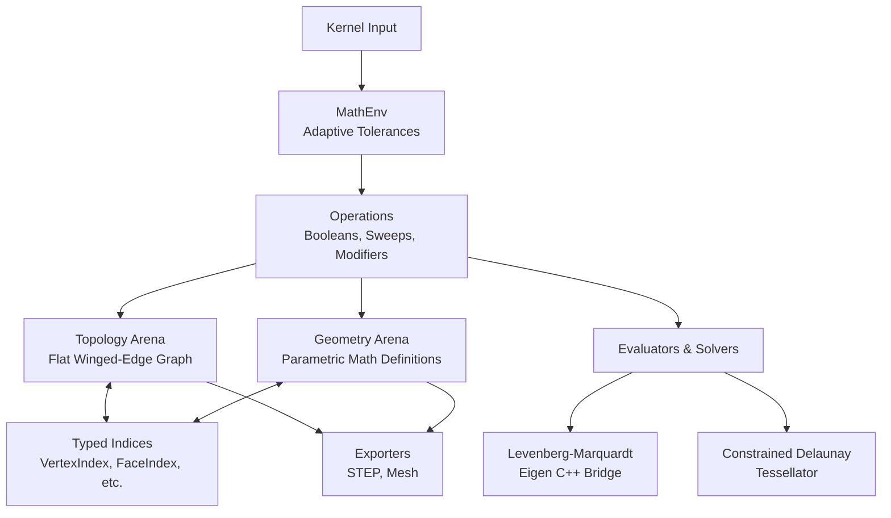
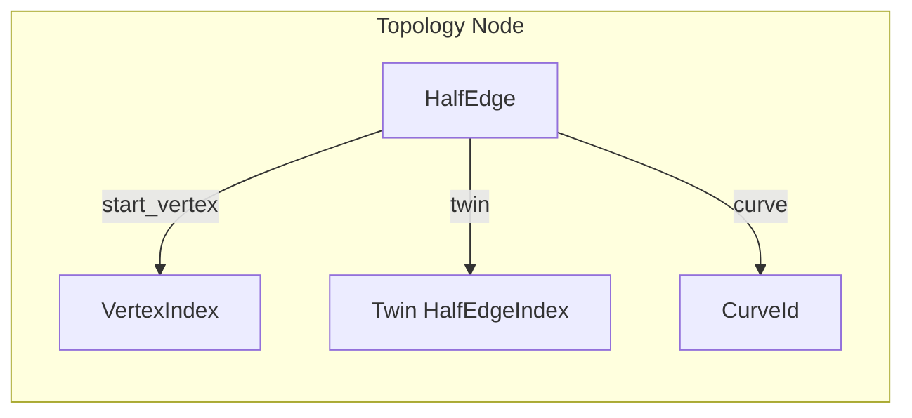

# Locus System Architecture & Memory Model

The Locus B-Rep kernel is structured as a mathematically exact, data-oriented geometric modeling engine. It is optimized for zero-pointer invalidation, cache-coherent memory layouts, and completely immutable topological operations to securely back higher-level caching architectures.

---

## 1. Data-Oriented Arenas

Locus explicitly rejects object-oriented pointer graphs. Memory is managed through two strictly decoupled, contiguous arrays (`ArrayListUnmanaged`), ensuring complete L1 cache density and zero GC traversal overhead.

* **Geometry Arena:** Stores pure mathematical equations and coordinates (Points, Lines, Planes, Cylinders, NURBS). It contains no connectivity data.
* **Topology Arena:** Stores the relational B-Rep graph (Vertices, Half-Edges, Loops, Faces). It contains no mathematical coordinates, only structural relationships.

By isolating these domains, Locus allows transformations (like rotations or scaling) to operate sequentially on flat coordinate arrays without ever walking a complex graph, executing in $O(1)$ contiguous memory sweeps.

---

## 2. The Winged-Edge Topology Graph

To establish relationships between topological boundaries without raw memory pointers, Locus utilizes **Typed Indices**.

* **Compiler-Enforced Enums:** Entity relationships are mapped using strict Zig enums (e.g., `FaceIndex`, `HalfEdgeIndex`, `VertexIndex`). This prevents a developer from accidentally passing a vertex ID into a face slot, resolving entire classes of memory corruption at compile time.
* **Structurally Dense Tagging:** References to mathematical objects use 32-bit packed structs (`CurveId`, `SurfaceId`). These pack a 24-bit integer index alongside an 8-bit enum tag (e.g., `.plane`, `.nurbs`), maximizing alignment density while maintaining polymorphic behavior.
* **Half-Edge Circulation:** Every solid boundary is defined by a `HalfEdge` containing its `twin` (adjacent face), `next`, `prev`, and the specific `VertexIndex` it originates from.

---

## 3. Parametric Geometry & Solvers

Geometry in Locus represents the exact, infinite mathematical boundaries that topology trims into finite faces.

* **Quadric & Freeform Support:** Natively supports Planes, Cylinders, Spheres, Cones, Toruses, and high-degree NURBS curves/surfaces.
* **Eigen Bridge:** Complex surface-surface intersections (SSI) rely on a Levenberg-Marquardt (LM) non-linear root finder bridged to the C++ Eigen library.
* **Bounding Volume Hierarchies (BVH):** To accelerate intersection checks on dense NURBS patches, Locus generates localized AABB BVH trees across the parametric $(U, V)$ domain, drastically reducing the search space before engaging the LM solver.

---

## 4. Adaptive Tolerancing (`MathEnv`)

Floating-point precision naturally degrades as bounding boxes scale. Locus eliminates hardcoded global epsilons by routing all coincidence operations through a dynamic `MathEnv` context.

* **Bounds Scaling:** When executing a boolean or sweep, the kernel calculates the localized bounding box and dynamically inflates the `MathEnv` tolerances relative to the object's physical size.
* **Grazing Angle Inflation:** During grazing intersections (where surfaces meet at near-parallel angles), the solver artificially inflates tolerances using the dot product to absorb floating-point drift and safely classify intersections.
* **Precomputed Optimization:** Hot-loop spatial checks utilize precomputed squared tolerances (`vertex_tol_sq`) mapped directly inside the `MathEnv`, saving hundreds of thousands of square-root calculations per CSG pass.

---

## 5. Immutable CSG & Modifiers

To support safe Directed Acyclic Graph (DAG) JIT execution, all high-level Locus operations are structurally immutable.

1. **Deep Cloning:** Operations like `trimByPlane`, `computeBoolean`, or `translateSolid` allocate a fresh `SolidIndex` and copy the source topology and geometry into the destination arena.
2. **Topological Mutation:** Splits, edge injections, and coplanar annihilations occur exclusively on the cloned structure.
3. **Cache Safety:** The original input handles remain perfectly intact, preventing downstream cache poisoning in applications relying on the kernel.

### The Boolean Pipeline

Constructive Solid Geometry (CSG) is evaluated using a multi-phase, exact intersection algorithm:

* **Phase 1 (Piercing):** Raycasts edges against target surfaces to identify 0D intersection points.
* **Phase 2 (Seam Generation):** Connects 0D nodes using exact curve intersections to generate 1D seams.
* **Phase 3 (Parallel Classification):** Uses multi-threaded raycasting to classify split faces as `.inside`, `.outside`, or `.same`.
* **Phase 4 (Healing):** Welds degenerate vertices, stitches open twins, and collapses coplanar seams back into a unified 2-manifold solid.

---

## 6. Tessellation & Mesh Generation

For rendering and spatial querying, exact B-Rep geometry must be converted into triangulated meshes.

* **Domain Projection:** 3D face boundaries are projected into 2D parametric $(U, V)$ space.
* **Constrained Delaunay Triangulation (CDT):** The 2D boundary points are tessellated using a Bowyer-Watson Delaunay algorithm.
* **Boundary Recovery:** Intersecting diagonal edges are mathematically flipped via `orient2D` and `inCircle` determinants until the physical constrained boundaries are restored.
* **Even/Odd Winding Culling:** Internal holes are culled from the resulting mesh by evaluating centroid raycasts against the 2D boundaries.
* **3D Re-Evaluation:** The surviving 2D UV triangles are fed back into the mathematical surface equations to map them into exact 3D space.

---

## Architecture Summary Matrix

| Component          | Primary Responsibility                      | Memory Strategy                     | Key Safety Invariants                  |
|--------------------|---------------------------------------------|-------------------------------------|----------------------------------------|
| **Geometry Arena** | Mathematical definitions and coordinates    | Flat $O(1)$ contiguous array slices | No structural interdependencies        |
| **Topology Arena** | Winged-edge connectivity graph              | Strongly-typed `Index` Enums        | Prevents raw pointer invalidation      |
| **MathEnv**        | Adaptive spatial and parametric tolerancing | Precomputed hot-loop squares        | Scales relative to object bounding box |
| **CSG Booleans**   | Union, Difference, Intersection operations  | Immutable deep cloning              | DAG cache preservation                 |

 |
| **Tessellator** | Exact B-Rep to Triangle Mesh conversion | Constrained Delaunay Triangulation | Strict Even/Odd internal hole culling |
| **STEP Exporter** | ISO 10303-21 compliant manufacturing export | Deduplicated ID maps | AP214 Advanced B-Rep standard alignment |
